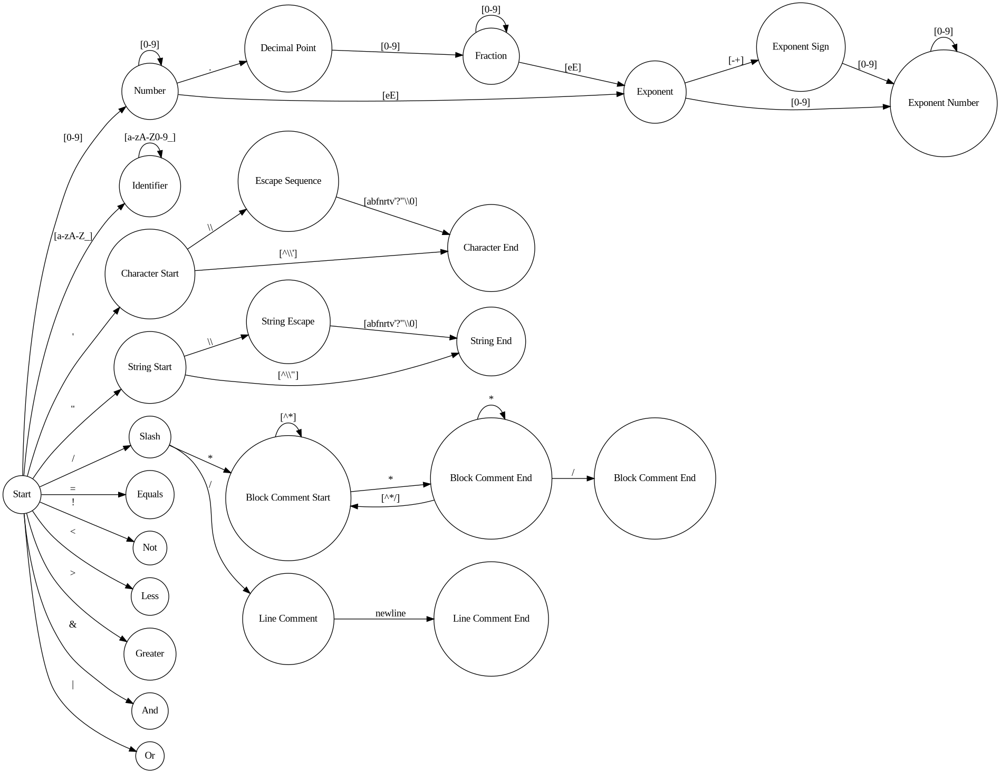

# AtomC Compiler

A simple **C** compiler for the **AtomC** programming language made for **Compilation Techniques** class. The compiler includes:


## Lexical Analyzer:
**The lexical analyzer** is responsible for breaking the input source code into a sequence of **tokens**.
It scans the input source code and converts it into a **sequence of tokens** that can be used by the other components of the compiler.

## Syntactic Analyzer:
**The syntactic analyzer** takes the token sequence generated by the lexical analyzer
and checks if the sequence of tokens corresponds to a valid program according to the **AtomC** programming language grammar.
If the sequence is valid, it generates an **abstract syntax tree** (**AST**) that represents the program's structure.

## Semantic Analysis:
**The semantic analysis** component checks the **AST** generated by the syntactic analyzer for semantic errors.
This includes checking for variable declarations, function declarations, and type mismatches.


## My implementation

- The **lexical analyzer** is based on the **diagram below**:

 


## Project Structure

- **`src/`**: Contains the source code files.

  - **`main.c`**: Main program logic.
  - **`lexer.c`**: token functions and states logic.
  - **`utils.c`**: utility functions.
  - **`parser.c`**: syntactic analyzer
  - **`da.c`**: domain analysis and symbol tables

- **`include/`**: Holds header files.

- **`obj/`**: Houses object files generated during compilation.

- **`bin/`**: Stores the executable files.

- **`Makefile`**: The Makefile for building the project.

- **`README.md`**: Documentation providing an overview of the project, its features, and instructions for usage.

- **`diagram.png`**: Lexical analyzer states diagram

- **`token-list.txt`**: List of tokens generated from lexical analyzer

## Usage

Go to the project folder and just type:
```bash
make
```

## License

This project is licensed under the terms of the [GNU GPLv3](LICENSE).
